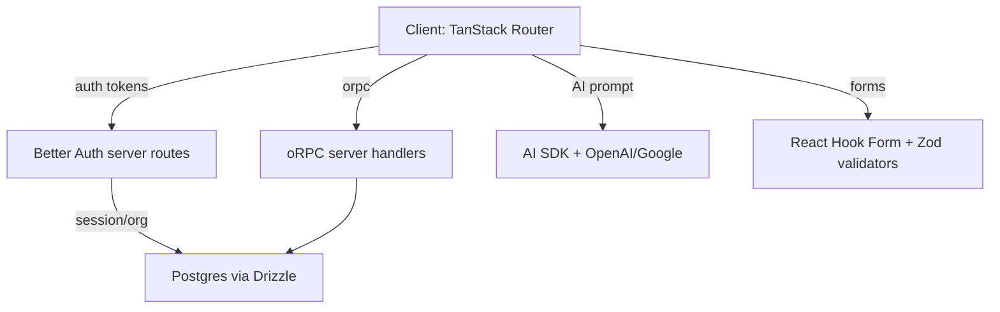

# Start Kit Template

Auth-first SaaS boilerplate. Fast, typed, accessible.

## Quick Start

```bash
bunx create-start-kit-dev create my-app
```

Or manually:

```bash
bun install
cp .env.example .env  # Fill in your values
bun dev
```

Visit http://localhost:3000

## Highlights

- React 19 + TanStack Start (React Router + SSR) + Vite
- Auth via Better Auth (organizations, passkeys, 2FA)
- AI: AI SDK + OpenAI/Google/Anthropic integrations
- oRPC + TanStack Query (type-safe RPC end-to-end)
- Payments: Stripe integration
- Storage: S3-compatible providers (AWS, R2, SeaweedFS)
- DB: PostgreSQL + Drizzle ORM
- Forms: React Hook Form + Zod + shadcn/ui wrappers
- i18n: i18next + react-i18next
- Styling: Tailwind v4 + shadcn/ui (Base UI) + CVA
- Testing: Vitest + React Testing Library
- Code quality: Ultracite (Biome), TypeScript

## Architecture



### Approach

- Type-safety end-to-end (Zod, Drizzle, oRPC, Better Auth types)
- Server calls via oRPC; React Query drives cache/invalidations
- Auth flows call `authClient` directly inside routes/components
- UI from `src/components/ui/*` (shadcn) with a11y baked-in
- Forms: `<Controller />` + `<Field />`; `data-invalid` + `aria-invalid` always
- Errors: throw in mutationFn; surface via `toast`/UI; no `console`

## Features

- **AI Chat**: Streaming chat interface with AI SDK, multi-provider support, voice input (speech-to-text)
- **Organizations**: Create/edit, slug check, logo; invite/accept; role-based permissions (owner/admin/member)
- **Security**: 2FA (TOTP), Passkeys (WebAuthn), sessions view, email verification, change password
- **Profile**: Avatar upload/remove; name/email update
- **Payments**: Stripe integration for subscriptions and one-time payments
- **Storage**: S3-compatible object storage (AWS, R2, SeaweedFS, Cloudflare R2)
- **DnD**: Drag-and-drop with @dnd-kit
- **Charts**: Data visualization with Recharts
- **Flow Diagrams**: Interactive node-based UI with XY Flow
- **i18n**: Locale switcher with lazy-loaded translation bundles

## File Structure

```
src/
  routes/              # TanStack Start file-based routes
  features/            # Feature modules (auth, organizations, settings)
  components/
    ui/                # shadcn primitives (~57 components)
    ai-elements/       # AI chat components
    guards/            # Permission guards for conditional rendering
    emails/            # React Email templates
  lib/
    auth/              # Better Auth config, client, permissions
    db/                # Drizzle schema, queries, RLS
    hooks/             # Shared hooks (permissions, etc.)
    validations/       # Zod schemas
  orpc/                # oRPC client/server setup
```

## Environment Variables

```bash
cp .env.example .env
```

**Required:**
- `DATABASE_URL` — PostgreSQL connection string
- `BETTER_AUTH_SECRET` — Generate: `openssl rand -base64 32`
- `BETTER_AUTH_BASE_URL` — Usually `http://localhost:3000`
- `VITE_BETTER_AUTH_BASE_URL` — Usually `http://localhost:3000`
- `RESEND_API_KEY` — From https://resend.com/api-keys

**Storage (required for uploads):**
- `S3_ACCESS_KEY_ID`, `S3_SECRET_ACCESS_KEY`, `S3_BUCKET`
- `S3_ENDPOINT` — Required for non-AWS providers

**Optional:**
- `OPENAI_API_KEY` — For AI chat
- `ANTHROPIC_API_KEY` — Anthropic provider
- `GOOGLE_GENERATIVE_AI_API_KEY` — Google AI provider
- `STRIPE_PUBLISHABLE_KEY`, `STRIPE_SECRET_KEY`, `STRIPE_WEBHOOK_SECRET` — Payments
- `BETTER_AUTH_TRUSTED_ORIGINS` — Comma-separated trusted origins for preview/staging
- `BETTER_AUTH_DISABLE_SIGN_UP` — Set to `true` to block new account registration (useful for demo/example deployments)

## Database Setup

Option A: Set `DATABASE_URL` manually (Neon, Supabase, etc.)

Option B: Run `bun dev` — the `vite-plugin-db` helper will prompt to create a Neon database.

Then push the schema:

```bash
bun run db:push
```

## Scripts

| Command | Description |
|---------|-------------|
| `bun run dev` | Start dev server |
| `bun run build` | Production build |
| `bun run start` | Start production server |
| `bun run test` | Run tests |
| `bun run test:watch` | Tests in watch mode |
| `bun run test:coverage` | Tests with coverage |
| `bun run db:push` | Push schema to database |
| `bun run db:generate` | Generate Drizzle migrations |
| `bun run db:studio` | Open Drizzle Studio |
| `bun run email:dev` | Preview emails (port 5555) |
| `bun run auth:generate` | Regenerate Better Auth schema |
| `bun run add-ui-components` | Add shadcn/ui components |
| `bun run check` | Lint and format check |
| `bun run fix` | Auto-fix lint and format |

## Permissions System

Role-based access control via Better Auth:

- **Owner**: Full control (manage org, invite/remove members, update roles, delete org)
- **Admin**: Manage org settings, invite/remove members
- **Member**: Read access

```tsx
<PermissionGuard permission="canInvite">
  <Button>Invite</Button>
</PermissionGuard>
```

## Speech Input (Voice-to-Text)

The AI Chat includes a speech input button that converts voice to text using a dual-mode approach for cross-browser support.

**How it works:**

| Browser | Mode | Backend Required |
|---------|------|------------------|
| Chrome | Web Speech API (real-time) | No |
| Firefox, Safari | MediaRecorder + OpenAI Whisper | Yes |

- **Chrome**: Uses the native Web Speech API for real-time transcription directly in the browser — no server calls needed.
- **Firefox/Safari**: Records audio via MediaRecorder, sends the audio blob to `POST /api/transcribe`, which transcribes it using OpenAI Whisper (`whisper-1`) via the AI SDK's `experimental_transcribe()`.

**API Endpoint:**

```
POST /api/transcribe
Content-Type: multipart/form-data

Body: FormData with "audio" field (Blob)
Response: { "text": "transcribed text" }
```

Requires authentication (uses the same session as the chat). Returns `401` if not authenticated, `400` if no audio file is provided.

**Requirements:**
- `OPENAI_API_KEY` environment variable must be set (also used by AI Chat)

**Component:** `SpeechInput` from `src/components/ai-elements/speech-input.tsx` — handles mode detection, recording UI, and callback wiring automatically.

## Storage

Supports any S3-compatible provider. See provider-specific setup:

| Provider | Endpoint |
|----------|----------|
| AWS S3 | Default (no endpoint needed) |
| Cloudflare R2 | `https://<account-id>.r2.cloudflarestorage.com` |
| SeaweedFS | `http://localhost:8333` (self-hosted) |
| DigitalOcean Spaces | `https://<region>.digitaloceanspaces.com` |
| Google Cloud Storage | `https://storage.googleapis.com` |

Features: presigned URLs, multi-tenant ownership, file validation (5MB max, image types), retry logic.

## Deployment

**Vercel (Bun):**
- Install: `bun install --frozen-lockfile`
- Build: `bun run bun:build`
- Env vars: `DATABASE_URL`, `BETTER_AUTH_SECRET`, `RESEND_API_KEY`, plus any provider keys

**Docker:**
```bash
bun run docker:build
docker run -p 3000:3000 --env-file .env tanstack-start-app
```

## Security

### CORS & Trusted Origins

The API uses environment-based CORS origin whitelisting. In development, `localhost:3000` and `localhost:3001` are trusted by default. In production, origins are derived from:

1. `BETTER_AUTH_BASE_URL` (always included)
2. Vercel preview URLs (auto-detected from `VERCEL_URL`, `VERCEL_BRANCH_URL`, `VERCEL_PROJECT_PRODUCTION_URL`)
3. `BETTER_AUTH_TRUSTED_ORIGINS` (comma-separated custom origins)

Wildcard patterns are supported (e.g. `https://*.my-app.vercel.app`).

To add ngrok or staging origins, set:
```bash
BETTER_AUTH_TRUSTED_ORIGINS="https://*.ngrok-free.dev,https://staging.example.com"
```

### Authentication & Email Verification

- Email verification is **required** for email/password sign-ups.
- Auth secret (`BETTER_AUTH_SECRET`) must be at least 32 characters. Generate one: `openssl rand -base64 32`.
- The OpenAPI reference endpoint (`/api/auth/reference`) is disabled in production.

### Security Headers

The production server (`backend.ts`) adds these headers to all responses:

| Header | Value |
|--------|-------|
| `X-Frame-Options` | `DENY` |
| `X-Content-Type-Options` | `nosniff` |
| `Referrer-Policy` | `strict-origin-when-cross-origin` |
| `Permissions-Policy` | `camera=(), microphone=(), geolocation=()` |
| `Content-Security-Policy` | `default-src 'self'; frame-ancestors 'none'` (+ inline scripts/styles) |

### File Upload Security

- Allowed types: JPEG, PNG, GIF, WebP (SVG is **not** allowed to prevent stored XSS)
- Maximum file size: 5 MB
- All storage endpoints verify file ownership (user ID or active organization ID)
- The `listBucket` endpoint is scoped to the current user/organization prefix

### Production Deployment Checklist

- [ ] Set `BETTER_AUTH_SECRET` (min 32 chars)
- [ ] Set `BETTER_AUTH_BASE_URL` to your production URL
- [ ] Set `BETTER_AUTH_TRUSTED_ORIGINS` if using preview deployments or custom domains
- [ ] Ensure `DATABASE_URL` points to a production-ready database
- [ ] Configure `RESEND_API_KEY` for email delivery (required for email verification)
- [ ] Set Stripe keys for payment features
- [ ] Verify CORS rejects unknown origins (`curl -H "Origin: https://evil.com" ...`)
- [ ] Verify `/api/auth/reference` returns 404 in production

## Troubleshooting

If `GET /` returns `500` in local dev:

1. Confirm required env vars are set (`BETTER_AUTH_SECRET`, `RESEND_API_KEY`, `S3_*`)
2. Start local infra: `docker compose up -d seaweedfs redis`
3. Push DB schema: `bun run db:push`
4. Restart: `bun dev`

## License

MIT
